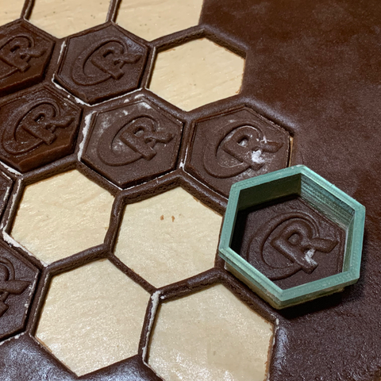

Hexagonal Cookie Cutters
================
Heike Hofmann
January 30, 2020

It turns out that it is quite easy to 3d print molds that allow us to
make delicious hexagonal cookies for our RStudio watch
party\!

The idea of the cookie cutters is to use a combination of a hexagonally
shaped cookie cutter and a corresponding stamp as shown in the
figure.

The underside of the stamp has the relief of the images you want to get
onto the cookie.

## STL files

We have made the stl files using TinkerCAD: for more
<a href="https://www.tinkercad.com/things/5W9p4xjzrwI-hexagonal-cookie-cutters">tinkering
of the molds</a>. We have printed the 3d files with a MonoPrice Mini v2
using Ultimaker Cura to export stl files to gcode:

  - <a href="STL files/HexagonCookieCutter.stl">Hexagonal cookie
    cutter</a>
  - <a href="STL files/RStampDeep.stl">R stamp</a>
  - <a href="STL files/HexStampBlank.stl">Blank stamp</a>

All models are sized to make hex stamps to match the exact size of
regular hexstickers (2 inch from tip to tip). We printed the models with
a raft, but without the use of any support structure. The stamp is
printed from the handle up - the overhang is low enough to not break
(using a fine print
\~.13mm).

